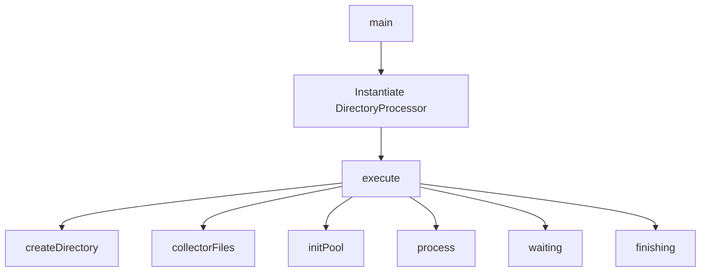
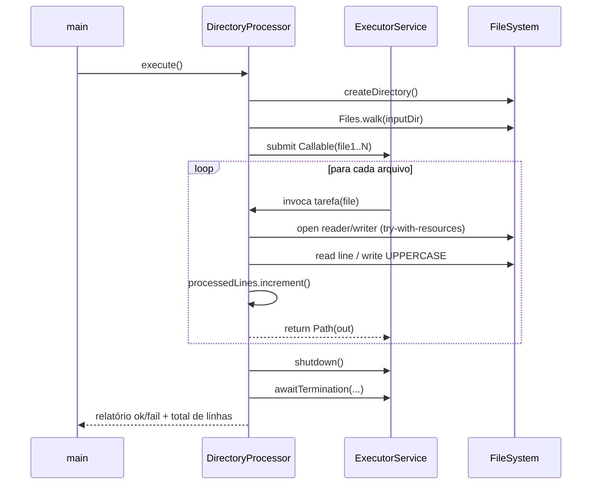

# File Processor – Java (ExecutorService)

Processamento concorrente de arquivos `.txt` em um diretório de entrada, salvando a saída (UPPERCASE) em um diretório de saída, com _logging_ estruturado e controle correto de concorrência e recursos.

> Classe principal: `DirectoryProcessor` 

---

## Tecnologias

Este projeto utiliza as seguintes tecnologias:

- **Java 8** → linguagem principal de implementação.  
- **Maven** → ferramenta de build, empacotamento e gestão de dependências.  
- **JUnit 5** → framework de testes unitários.  
- **SLF4J** → API de logging.  
- **Logback** → implementação de logging (console + rotação de arquivos).  
- **ExecutorService (Java Concurrency)** → processamento paralelo com pool de threads fixo.  
- **LongAdder** → contador thread-safe para acompanhar o total de linhas processadas com baixa contenção.  
- **Maven Shade Plugin** → gera JAR executável (_uber-jar_) com dependências embutidas.  
- **Maven Exec Plugin** → permite executar a aplicação via Maven, incluindo execução automática durante o `install` (perfil `run-on-install`).  
- **GitHub Actions** → integração contínua (CI), rodando build, testes e empacotamento no pipeline.  

---

## Informação complementar

Desenvolvido como parte do processo seletivo para a vaga Senior Developer – Technical Assessment – Debugging & Code Review 4.pdf.

---

## 1) Análise do snippet original (fornecido no teste)

**Problemas identificados:**
- `ArrayList` global e mutável acessado por múltiplas threads (não thread-safe).  
- 10 tarefas lendo **o mesmo arquivo** do zero (I/O redundante).  
- `shutdown()` chamado e o programa imprime `lines.size()` **antes** das tarefas terminarem.  
- Recursos de I/O não garantidamente fechados.  
- Uso de `FileReader("data.txt")` com charset da plataforma e caminho fixo.  
- Tratamento de exceções com `printStackTrace()` (ruído/sem contexto).  

---

## 2) Correções e boas práticas aplicadas

A implementação do `DirectoryProcessor` traz melhorias:

| Problema (original) | Correção aplicada |
|---------------------|------------------|
| Lista não thread-safe | Substituído por `LongAdder processedLines`, que é thread-safe e ideal para contagem em alta concorrência |
| Leitura redundante | Cada tarefa processa **um arquivo** apenas |
| Finalização incorreta | Uso de `Future#get()` e `awaitTermination()` |
| Vazamento de I/O | `try-with-resources` para `BufferedReader`/`BufferedWriter` |
| Charset/caminho fixos | Uso de `Paths.get()` e `UTF-8` explícito |
| Exceções mal tratadas | Logging estruturado com SLF4J, mensagens com contexto |
| Diretório de saída | Criação idempotente e validações robustas |
| Determinismo | Conversão com `Locale.ROOT` |

### Vantagens do uso de `LongAdder`
- Thread-safe sem locks explícitos.  
- Melhor desempenho que `AtomicLong` sob alta concorrência (menos contenção).  
- Mais leve que acumular todas as linhas em memória (`List<String>`).  
- Método `sum()` permite recuperar o total processado.

---

## 3) Fluxo (Mermaid)



---

## 4) Sequência (Mermaid)



---

## 5) Execução e Empacotamento

O projeto pode ser executado de diferentes formas, dependendo da sua necessidade:

### A) Compilação manual (Java puro)
```bash
# Compilar
javac -cp ".:libs/*" com/example/fileprocessor/DirectoryProcessor.java

# Executar (args: inputDir outputDir nThreads)
java -cp ".:libs/*" com.example.fileprocessor.DirectoryProcessor in out 6
```

### B) Empacotar e rodar manualmente (Maven)
O `pom.xml` está configurado para gerar um **JAR executável (_uber-jar_)** com todas as dependências embutidas.

```bash
# Gera o JAR com dependências
mvn clean package -DskipTests

# Executa o JAR
java -jar target/file-processor-1.0.0-all.jar in out 6
```

- Arquivo final: `target/file-processor-1.0.0-all.jar`  
- Classe principal: `com.example.fileprocessor.DirectoryProcessor` (definida em `<main.class>` no `pom.xml`).  

### C) Execução automática durante `install` (opcional)
Também é possível rodar a aplicação automaticamente durante o `mvn install`.

```bash
mvn clean install -Prun-on-install -Dexec.args="in out 6"
```

- `-Prun-on-install` → ativa o perfil que executa a aplicação logo após o empacotamento.  
- `-Dexec.args="in out 6"` → argumentos passados para a classe principal (`inputDir outputDir nThreads`).  

---

## 6) Logback

Arquivo `src/main/resources/logback.xml`:

```xml
<configuration>
    <appender name="CONSOLE" class="ch.qos.logback.core.ConsoleAppender">
        <encoder>
            <pattern>%d{yyyy-MM-dd HH:mm:ss} %-5level [%thread] %logger{36} - %msg%n</pattern>
        </encoder>
    </appender>

    <appender name="FILE" class="ch.qos.logback.core.rolling.RollingFileAppender">
        <file>logs/app.log</file>
        <rollingPolicy class="ch.qos.logback.core.rolling.TimeBasedRollingPolicy">
            <fileNamePattern>logs/app.%d{yyyy-MM-dd}.log</fileNamePattern>
            <maxHistory>7</maxHistory>
        </rollingPolicy>
        <encoder>
            <pattern>%d{yyyy-MM-dd HH:mm:ss} %-5level [%thread] %logger{36} - %msg%n</pattern>
        </encoder>
    </appender>

    <root level="INFO">
        <appender-ref ref="CONSOLE" />
        <appender-ref ref="FILE" />
    </root>

    <logger name="com.example.fileprocessor" level="DEBUG"/>
</configuration>
```

---

## 7) Estrutura sugerida

```
.
├─ README.md
├─ pom.xml
├─ src
│  ├─ main
│  │  ├─ java/com/example/fileprocessor/DirectoryProcessor.java
│  │  └─ resources/logback.xml
│  └─ test
│     └─ java/com/example/fileprocessor/DirectoryProcessorTest.java
├─ in/    # entrada (gitignore opcional)
└─ out/   # saída (gitignore)
```

---

## 8) Melhorias futuras

- Nomear threads do pool (`ThreadFactory` custom).  
- Usar `CompletionService` para colher tarefas conforme finalizam.  
- Adicionar **retry/backoff** para falhas transitórias.  
- Validar permissões de escrita no `outputDir`.  
